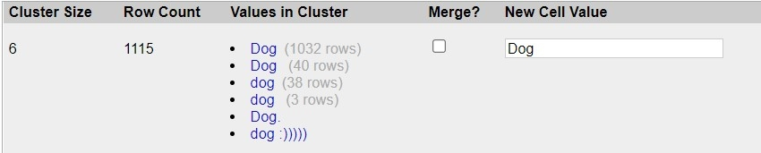

# Part 1: Data Cleaning

## Cleaning using GREL Statements:

1.  First of all in the column “What kind of pet it is”, we can see pet
    name “Dog” occurring in different spelling as shown below:-

-   This can be replaced by following GREL Statement:-

-   value.replace(“Dig”,“Dog”).replace(“dig”,“Dog”).replace(“Doggo”,“Dog”).replace(“God”,“Dog”).replace(“Pit
    bull”,“Dog”).replace(“Puppy”,“Dog”).replace(“Sog”,“Dog”).replace(“dig”,“Dog”).replace(“dlg”,“Dog”)

-   Similarly there are lots of redundant entries falling into the same
    category, so we can replace them just as we did above:-

-   value.replace(“cat”,“Cat”).replace(“Cat!”,“Cat”)
-   value.replace(“hamster”,“Hamster”)
-   value.replace(“Guinea pig”,“Guinea Pig”)
-   value.replace(“bunny”,“Bunny”)
-   value.replace(“Hermit crab”,“Hermit Crab”)
-   value.replace(” Cat”,“Cat”)
-   value.replace(“Cats”,“Cat”)
-   value.replace(“Kitty Meow”,“Cat”).replace(“Kitten”,“Cat”)
-   value.replace(“Dog :)))))”,“Dog”)
-   value.replace(“Beta fish”,“Betta fish”)

2.  There is a category termed as “Other” as shown below:-

-   So I have removed the term “Other” from front and replaced with only
    particular pet names using GREL statement as below:-
-   value.replace(“Other (fish)”,“Fish”).replace(“Other- guinea
    pig”,“Guinea Pig”).replace(“Other: bees”,“Bees”).replace(“Other:
    snake”,“Snake”).replace(“Other: prairie Dog”,“Prairie Dog”)

3.  There are some categories which are not categorized as pets. They
    are shown below:-

 

-   I have replaced them with “Other” category using the below GREL
    statement:- value.replace(“Card Board
    Poster”,“Other”).replace(“Robot”,“Other”).replace(“Roomba”,“Other”).replace(“Server”,“Other”).replace(“Virus”,“Other”).replace(“(blank)”,“Other”)

4.  There are some blank entries too as shown below:-

-   Now to remove them here is what I did:
-   From the drop down menu of that column click “Facet” then click on
    “Customized Facets”.
-   After that click on “Facet by blank(null or empty string)”.
-   After doing this click on true from the facet menu appear at left
    side.

-   Finally click on drop down menu of “All->Edit rows->Remove matching
    rows”.

## Manual Editing:-

1.  For “What kind of pet it is” column:-

-   After performing above mentioned steps, the clusters look like
    this:-

 

-   Then I have merged this clusters by going to the drop down menu,
    Edit cells->Cluster and edit->Merge Selected & Re-cluster.

-   There were multiple entries in same cell as shown below:-

-   To seperate them:-
    -   Edit cell->split multi valued cells-> by seperator(mention “,”
        as seperator)->ok 

2.  For “Pet’s Breed” column:-

-   Below you can see the redundant entries that contains spelling
    errors:-

 

-   I have merged them together using Cluster and Edit feature of column
    just as mentioned above in step 1.
-   Also I have tried different methods,i.e.”key collision” and “nearest
    neighbor” and different keying functions to merge the clusters.

3.  For “Pet’s Age” column:-

-   I performed “Edit cells->Common transforms->To number”

-   There were redundant entries as shown below:-

-   I get rid of them and re-clustered by applying Cluster and Edit
    feature.

4.  For “Pet’s Full Name” column:-

-   The same redundancy is seen here:-

-   To get rid of it I applied Cluster and Edit feature and re-clustered
    them.

# Part 2:- Analyze Cleaned Data

1.  How many types (kinds) of pets are there?

    -   36

2.  How many dogs?

    -   1123

3.  How many breeds of dogs?

    -   399(exclucing blank entries)

4.  What’s the most popular dog breed?

    -   Golden Retriever

5.  What’s the age range of the dogs?

    -   6 week to 30

6.  What’s the age range of the guinea pigs?

    -   1 to 5

7.  What is the oldest pet?

    -   Dog

8.  Which are more popular, betta fish or goldfish? How many of each?

    -   Goldfish is popular. Goldfish:5, Betta Fish: 2

9.  What’s the most popular everyday name for a cat?

    -   Kitty

10. What’s the most popular full name for a dog?

-   Maggie

# References

1.  <https://wordpress.com/support/markdown-quick-reference/>
2.  <https://docs.openrefine.org/manual/grelfunctions#splits-s-or-p-sep-b-preservetokens-optional>
3.  <https://webscraper.io/blog/data-transformation-with-Open-Refine>
4.  <http://www.morgancurrie.com/wp-content/uploads/2016/12/Open_Refine_Tut2.pdf>
5.  <https://datacarpentry.org/openrefine-socialsci/04-numbers/>
6.  <https://stackoverflow.com/questions/24840767/filter-only-by-having-blank-empty-string-cells/24841276#24841276>
7.  <https://guides.library.illinois.edu/openrefine/splitting>
